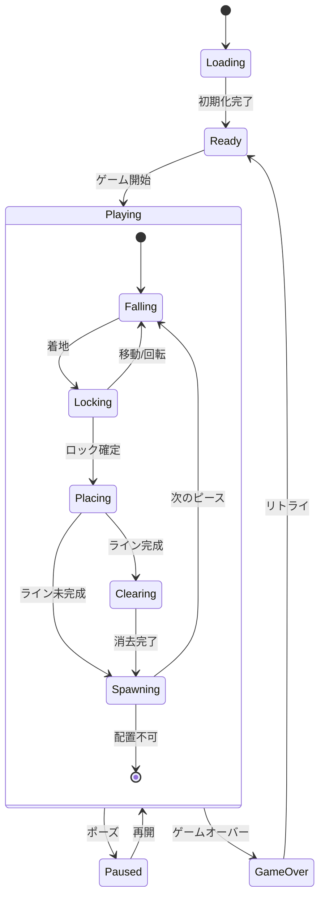

# ポリオミノゲーム完全設計書

## 1. プロジェクト概要

TypeScriptとCanvas API、Reactを使用した、4〜9マスのポリオミノ（テトリス系）ゲーム。UIコンポーネントはReactで、ゲームレンダリングはCanvas APIで実装。クラスを使わない実用的なTypeScriptとTDD（テスト駆動開発）で開発。

### 技術スタック

- TypeScript 5.x（strict mode）
- React 18.x（UIコンポーネント）
- Canvas API（ゲームレンダリング）
- Web Audio API（音声）
- Vite（ビルドツール）
- Vitest（テストフレームワーク）
- LocalStorage（データ永続化）

### 開発原則

1. **TDD**: テストを先に書いてから実装
2. **型安全**: TypeScriptの型システムを最大限活用
3. **実用的**: 過度な関数型プログラミングは避け、可読性を重視
4. **テスタブル**: 副作用を分離し、純粋関数を中心に構成

## 2. ゲーム画面仕様

### 画面レイアウト

```
┌─────────────────────────────────────────────────────────────┐
│  POLYOMINO GAME                              [♪] [⚙]       │
│┌──────────┬───────────────────────┬────────────────────────┐│
││ SCORE    │                       │ NEXT                   ││
││ 000000   │                       │ ┌─────┐                ││
││          │                       │ │     │                ││
││ LEVEL    │                       │ │     │                ││
││ 01       │                       │ └─────┘                ││
││          │      GAME BOARD       │                        ││
││ LINES    │     (12 x 25)        │ HOLD                   ││
││ 000      │                       │ ┌─────┐                ││
││          │                       │ │     │                ││
││ TIME     │                       │ │     │                ││
││ 00:00    │                       │ └─────┘                ││
││          │                       │                        ││
││ HIGH     │                       │ PIECES (5 POLYOMINO)  ││
││ 000000   │                       │ ┌─┬─┬─┬─┬─┬─┬─┐      ││
││          │                       │ │F│I│L│N│P│T│▼│ x12  ││
││ APM      │                       │ └─┴─┴─┴─┴─┴─┴─┘      ││
││ 000      │                       │ [2][0][1][3][0][1]    ││
│└──────────┴───────────────────────┴────────────────────────┘│
│ [NEW GAME] [PAUSE]              Size: [5▼] Theme: [Gruvbox▼]│
└─────────────────────────────────────────────────────────────┘
```

### 画面要素詳細仕様

#### メインボード（中央）

| ポリオミノサイズ | ボードサイズ | セルサイズ |
| ---------------- | ------------ | ---------- |
| 4マス            | 10×20        | 24px       |
| 5マス            | 12×25        | 20px       |
| 6マス            | 14×30        | 18px       |
| 7マス            | 16×32        | 16px       |
| 8マス            | 18×35        | 14px       |
| 9マス            | 20×38        | 12px       |

- グリッド線: 1px（カラースキーム準拠）
- ゴーストピース: opacity 0.3
- 背景: セル間に微細なグラデーション

#### 左パネル（統計情報）

- **SCORE**: 6桁表示、カンマ区切り
- **LEVEL**: 2桁表示、レベル10以降は高速化
- **LINES**: 3桁表示、999でカンスト表示
- **TIME**: MM:SS形式、59:59でカンスト
- **HIGH**: 現在のサイズでの最高記録
- **APM**: Actions Per Minute（直近1分間）

#### 右パネル（ゲーム情報）

- **NEXT**: 次のピース（中央配置）
- **HOLD**: 保持ピース（未使用時は暗転）
- **PIECES**: 全形状のミニプレビュー
  - 7個以上はスクロール表示
  - 使用回数をバッジ表示
  - 現在のピースはハイライト

## 3. ゲーム仕様詳細

### 基本ルール

#### 操作系

| 操作           | キー      | 詳細            | リピート |
| -------------- | --------- | --------------- | -------- |
| 左移動         | ← / A     | 1マス左へ       | DAS対応  |
| 右移動         | → / D     | 1マス右へ       | DAS対応  |
| ソフトドロップ | ↓ / S     | 20倍速落下      | 継続     |
| ハードドロップ | Space     | 即座に着地      | なし     |
| 右回転         | ↑ / X     | 時計回り90度    | なし     |
| 左回転         | Z / Ctrl  | 反時計回り90度  | なし     |
| ホールド       | C / Shift | ピース保持/交換 | なし     |
| ポーズ         | P / Esc   | 一時停止        | なし     |

#### DAS（Delayed Auto Shift）詳細

```
初回キー押下
    ↓
[167ms待機]
    ↓
移動開始（33msごと）
    ↓
キー解放で停止
```

#### 回転システム（SRS風）

```typescript
// 回転時の補正試行順序
const kickTable = {
  clockwise: [
    [0, 0], // 1. そのまま
    [-1, 0], // 2. 左へ1
    [1, 0], // 3. 右へ1
    [0, -1], // 4. 上へ1
    [-1, -1], // 5. 左上
    [1, -1], // 6. 右上
  ],
  counterClockwise: [
    [0, 0],
    [1, 0],
    [-1, 0],
    [0, -1],
    [1, -1],
    [-1, -1],
  ],
};
```

### スコアリングシステム

#### 基本スコア

- ピース設置: 10点
- ソフトドロップ: 1点/マス
- ハードドロップ: 2点/マス

#### ライン消去

| ライン数 | 基礎点 | 計算式                     |
| -------- | ------ | -------------------------- |
| 1        | 100    | 100 × level                |
| 2        | 300    | 300 × level                |
| 3        | 500    | 500 × level                |
| 4        | 800    | 800 × level                |
| 5+       | 1000+  | (1000 + 200×(n-4)) × level |

#### レベルシステム

- 開始レベル: 1
- レベルアップ: 10ライン消去ごと
- 落下速度: `1000ms / (level + 9)`
- 最高レベル: 20（それ以降は速度固定）

### 7-Bagシステム仕様

```typescript
// 全ピースを1セットとして管理
type Bag = PieceType[];

// 初期化時とバッグが空になったら補充
function refillBag(pieceTypes: PieceType[]): Bag {
  return shuffle([...pieceTypes]);
}

// 次のピースを取得
function getNextPiece(
  currentBag: Bag,
  allTypes: PieceType[],
): {
  piece: PieceType;
  remainingBag: Bag;
} {
  if (currentBag.length === 0) {
    const newBag = refillBag(allTypes);
    return {
      piece: newBag[0],
      remainingBag: newBag.slice(1),
    };
  }
  return {
    piece: currentBag[0],
    remainingBag: currentBag.slice(1),
  };
}
```

### ロックディレイシステム

- 着地後の猶予時間: 500ms
- 移動/回転でリセット
- 最大リセット回数: 15回
- 15回目以降は即座に固定

## 4. プロジェクト構造

```
polyomino-game/
├── src/
│   ├── game/
│   │   ├── __tests__/
│   │   │   ├── board.test.ts
│   │   │   ├── piece.test.ts
│   │   │   ├── collision.test.ts
│   │   │   ├── scoring.test.ts
│   │   │   ├── bag.test.ts
│   │   │   └── lockDelay.test.ts
│   │   ├── types.ts          # 全ての型定義
│   │   ├── board.ts          # ボード操作
│   │   ├── piece.ts          # ピース操作
│   │   ├── collision.ts      # 衝突判定
│   │   ├── scoring.ts        # スコア計算
│   │   ├── bag.ts            # 7-Bagシステム
│   │   ├── lockDelay.ts      # ロックディレイ
│   │   └── gameLoop.ts       # メインループ
│   ├── polyomino/
│   │   ├── __tests__/
│   │   │   └── generator.test.ts
│   │   ├── generator.ts      # ポリオミノ生成
│   │   ├── shapes.ts         # 形状定義
│   │   └── validator.ts      # 形状検証
│   ├── rendering/
│   │   ├── __tests__/
│   │   │   ├── renderer.test.ts
│   │   │   └── animator.test.ts
│   │   ├── renderer.ts       # Canvas描画
│   │   ├── colorSchemes.ts   # カラーテーマ
│   │   ├── animator.ts       # アニメーション
│   │   └── particles.ts      # パーティクル効果
│   ├── input/
│   │   ├── __tests__/
│   │   │   └── inputHandler.test.ts
│   │   ├── inputHandler.ts   # 入力処理
│   │   └── keyConfig.ts      # キー設定
│   ├── audio/
│   │   ├── __tests__/
│   │   │   └── soundEngine.test.ts
│   │   ├── soundEngine.ts    # 音声エンジン
│   │   ├── effects.ts        # 効果音定義
│   │   └── music.ts          # BGM管理
│   ├── storage/
│   │   ├── __tests__/
│   │   │   └── storage.test.ts
│   │   └── storage.ts        # データ永続化
│   ├── ui/
│   │   ├── __tests__/
│   │   │   └── components.test.ts
│   │   ├── components.ts     # UI部品
│   │   ├── modals.ts         # モーダル
│   │   └── themes.ts         # UIテーマ
│   ├── utils/
│   │   ├── __tests__/
│   │   │   └── helpers.test.ts
│   │   ├── helpers.ts        # ユーティリティ
│   │   ├── math.ts           # 数学関数
│   │   └── debug.ts          # デバッグ用
│   └── main.ts               # エントリポイント
├── public/
│   ├── index.html
│   └── favicon.ico
├── docs/
│   ├── ARCHITECTURE.md       # アーキテクチャ
│   ├── DEVELOPMENT.md        # 開発ガイド
│   ├── API.md               # 関数仕様
│   └── LEARNINGS.md         # 学習記録
├── .github/
│   └── workflows/
│       └── ci.yml           # CI設定
├── package.json
├── tsconfig.json
├── vite.config.ts
├── vitest.config.ts
├── .eslintrc.js
├── .prettierrc
└── README.md
```

## 5. 詳細型定義

```typescript
// ============================================
// 基本型
// ============================================

// 座標（イミュータブル）
export type Coordinate = readonly [x: number, y: number];

// ポリオミノ形状（座標の配列）
export type PolyominoShape = readonly Coordinate[];

// ピースタイプ（動的生成のため文字列ID）
export type PieceType = string;

// 回転角度
export type Rotation = 0 | 1 | 2 | 3;

// ゲーム状態
export type GameStatus =
  | "ready"
  | "playing"
  | "paused"
  | "gameover"
  | "loading";

// ============================================
// ゲーム設定
// ============================================

export interface GameConfig {
  polyominoSize: 4 | 5 | 6 | 7 | 8 | 9;
  boardDimensions: {
    width: number;
    height: number;
  };
  rendering: {
    cellSize: number;
    gridLineWidth: number;
    animationDuration: number;
  };
  gameplay: {
    initialDropInterval: number;
    softDropMultiplier: number;
    lockDelay: number;
    maxLockResets: number;
    dasDelay: number;
    dasInterval: number;
  };
  features: {
    ghostPieceEnabled: boolean;
    holdEnabled: boolean;
    nextPieceCount: number;
  };
  audio: {
    soundEnabled: boolean;
    musicEnabled: boolean;
    effectVolume: number;
    musicVolume: number;
  };
  theme: {
    colorScheme: ColorSchemeName;
    particleEffects: boolean;
  };
}

// ============================================
// ゲーム状態
// ============================================

export interface GameState {
  // ボード状態
  board: Board;

  // ピース関連
  currentPiece: ActivePiece | null;
  ghostPiece: GhostPiece | null;
  nextPieces: PieceType[];
  heldPiece: PieceType | null;
  pieceBag: PieceType[];

  // ゲーム進行
  status: GameStatus;
  score: number;
  lines: number;
  level: number;

  // タイマー
  gameTime: number;
  dropTimer: number;
  lockTimer: number;
  lockResetCount: number;

  // 統計
  stats: GameStats;

  // フラグ
  canHold: boolean;
  isPaused: boolean;
}

// ============================================
// ピース関連
// ============================================

export interface ActivePiece {
  type: PieceType;
  shape: PolyominoShape;
  position: Coordinate;
  rotation: Rotation;
  color: string;
}

export interface GhostPiece {
  position: Coordinate;
  shape: PolyominoShape;
}

export interface PieceDefinition {
  id: PieceType;
  shape: PolyominoShape;
  rotations: readonly PolyominoShape[];
  color: string;
  boundingBox: BoundingBox;
}

export interface BoundingBox {
  width: number;
  height: number;
  offsetX: number;
  offsetY: number;
}

// ============================================
// ボード
// ============================================

export type Cell = {
  type: PieceType;
  color: string;
} | null;

export type Board = readonly (readonly Cell[])[];

export interface BoardUpdate {
  board: Board;
  clearedLines: number[];
  score: number;
}

// ============================================
// 入力
// ============================================

export interface InputState {
  keys: {
    left: boolean;
    right: boolean;
    down: boolean;
    rotateLeft: boolean;
    rotateRight: boolean;
    hardDrop: boolean;
    hold: boolean;
    pause: boolean;
  };
  das: {
    direction: "left" | "right" | null;
    timer: number;
    charged: boolean;
  };
}

export interface KeyBinding {
  action: keyof InputState["keys"];
  keys: string[];
}

// ============================================
// レンダリング
// ============================================

export interface RenderContext {
  canvas: HTMLCanvasElement;
  ctx: CanvasRenderingContext2D;
  config: GameConfig;
  theme: ColorScheme;
}

export interface ColorScheme {
  name: string;
  colors: {
    background: string;
    board: string;
    grid: string;
    text: string;
    textSecondary: string;
    ghost: string;
    pieces: string[];
    ui: {
      panel: string;
      button: string;
      buttonHover: string;
      border: string;
    };
    effects: {
      lineClear: string[];
      levelUp: string[];
      gameOver: string;
    };
  };
}

export type ColorSchemeName =
  | "gruvbox"
  | "monokai"
  | "dracula"
  | "nord"
  | "solarized"
  | "tokyo-night";

// ============================================
// アニメーション
// ============================================

export interface Animation {
  type: "lineClear" | "levelUp" | "piecePlace" | "gameOver";
  startTime: number;
  duration: number;
  data: any;
}

export interface Particle {
  position: Coordinate;
  velocity: Coordinate;
  lifetime: number;
  color: string;
  size: number;
}

// ============================================
// 音声
// ============================================

export interface SoundEffect {
  name: string;
  frequency: number;
  duration: number;
  type: OscillatorType;
  envelope: {
    attack: number;
    decay: number;
    sustain: number;
    release: number;
  };
}

// ============================================
// 統計
// ============================================

export interface GameStats {
  startTime: number;
  endTime: number | null;
  piecesPlaced: number;
  pieceCounts: Record<PieceType, number>;
  lineClearCounts: Record<number, number>;
  totalMoves: number;
  totalRotations: number;
  holdCount: number;
  hardDropCount: number;
  softDropDistance: number;
  apm: number; // Actions Per Minute
  pps: number; // Pieces Per Second
}

// ============================================
// ストレージ
// ============================================

export interface SaveData {
  config: Partial<GameConfig>;
  highScores: Record<number, HighScore[]>;
  statistics: LifetimeStats;
  keyBindings: KeyBinding[];
}

export interface HighScore {
  score: number;
  level: number;
  lines: number;
  time: number;
  date: string;
  polyominoSize: number;
}

export interface LifetimeStats {
  totalGames: number;
  totalScore: number;
  totalLines: number;
  totalTime: number;
  favoriteSize: number;
  achievements: Achievement[];
}

export interface Achievement {
  id: string;
  name: string;
  description: string;
  unlockedAt: string | null;
}

// ============================================
// エラーハンドリング
// ============================================

export interface GameError {
  code: string;
  message: string;
  context?: any;
  recoverable: boolean;
}

export type Result<T, E = GameError> =
  | { ok: true; value: T }
  | { ok: false; error: E };
```

## 6. 状態遷移仕様



## 7. エラーハンドリング仕様

### エラー種別

```typescript
export const ERROR_CODES = {
  // 初期化エラー
  INIT_CANVAS_FAILED: "E001",
  INIT_AUDIO_FAILED: "E002",
  INIT_STORAGE_FAILED: "E003",

  // ゲームエラー
  INVALID_PIECE_POSITION: "E101",
  INVALID_BOARD_STATE: "E102",
  PIECE_GENERATION_FAILED: "E103",

  // 入力エラー
  INVALID_KEY_BINDING: "E201",
  INPUT_HANDLER_FAILED: "E202",

  // レンダリングエラー
  RENDER_CONTEXT_LOST: "E301",
  ANIMATION_FAILED: "E302",

  // ストレージエラー
  STORAGE_QUOTA_EXCEEDED: "E401",
  STORAGE_CORRUPTED: "E402",
} as const;
```

### エラーハンドリング方針

1. **回復可能なエラー**: ゲームを継続し、エラーメッセージを表示
2. **致命的なエラー**: ゲームを停止し、リロードを促す
3. **デバッグ情報**: 開発モードではコンソールに詳細を出力

## 8. パフォーマンス要件

### 目標値

- **FPS**: 60fps維持（16.67ms/フレーム）
- **入力遅延**: 1フレーム以内
- **メモリ使用量**: 50MB以下
- **初期読み込み**: 2秒以内

### 最適化戦略

```typescript
// レンダリング最適化
const optimizations = {
  // ダーティフラグによる部分描画
  dirtyRegions: true,

  // オフスクリーンCanvas使用
  doubleBuffering: true,

  // 不要な再計算を避ける
  memoization: true,

  // requestAnimationFrameによる描画
  rafScheduling: true,
};
```

## 9. ブラウザ互換性

### 対応ブラウザ

- Chrome 90+
- Firefox 88+
- Safari 14+
- Edge 90+

### 必要なAPI

- Canvas 2D Context
- Web Audio API
- LocalStorage
- ES2020+

## 10. 完全TODOリスト

### Phase 0: プロジェクト初期化

- [ ] プロジェクトディレクトリ作成
- [ ] package.json初期化
  ```json
  {
    "name": "polyomino-game",
    "version": "1.0.0",
    "type": "module",
    "scripts": {
      "dev": "vite",
      "build": "tsc && vite build",
      "test": "vitest",
      "test:ui": "vitest --ui",
      "coverage": "vitest --coverage",
      "lint": "eslint src --ext .ts",
      "format": "prettier --write src/**/*.ts"
    }
  }
  ```
- [ ] 依存関係インストール
- [ ] tsconfig.json設定（strict: true必須）
- [ ] vite.config.ts作成
- [ ] vitest.config.ts作成
- [ ] .eslintrc.js / .prettierrc設定
- [ ] ディレクトリ構造作成（上記の通り）
- [ ] .gitignore作成

### Phase 1: 型定義とユーティリティ（TDD）

- [ ] src/game/types.ts作成（上記の型定義全て）
- [ ] src/utils/helpers.test.ts作成
  - [ ] shuffle関数のテスト
  - [ ] clamp関数のテスト
  - [ ] deepClone関数のテスト
  - [ ] range関数のテスト
- [ ] src/utils/helpers.ts実装
- [ ] src/utils/math.test.ts作成
  - [ ] 回転行列のテスト
  - [ ] 座標変換のテスト
- [ ] src/utils/math.ts実装

### Phase 2: ポリオミノ生成システム（TDD）

- [ ] src/polyomino/generator.test.ts作成
  - [ ] 各サイズのポリオミノ数検証（1:1, 2:1, 3:2, 4:7, 5:12, 6:35, 7:108, 8:369, 9:1285）
  - [ ] 形状の一意性テスト
  - [ ] 回転・反転の正規化テスト
  - [ ] 境界ボックス計算テスト
- [ ] src/polyomino/generator.ts実装
  - [ ] generatePolyominoes関数
  - [ ] normalizeShape関数
  - [ ] getAllRotations関数
  - [ ] getBoundingBox関数
- [ ] src/polyomino/validator.test.ts作成
  - [ ] 連結性チェックテスト
  - [ ] 重複チェックテスト
- [ ] src/polyomino/validator.ts実装
- [ ] src/polyomino/shapes.ts作成
  - [ ] ポリオミノキャッシュ管理
  - [ ] ID割り当て

### Phase 3: ゲームボード管理（TDD）

- [ ] src/game/board.test.ts作成
  - [ ] createEmptyBoardテスト
  - [ ] placePieceテスト（イミュータブル）
  - [ ] removePieceテスト
  - [ ] getFilledLinesテスト
  - [ ] clearLinesテスト（アニメーション用データ含む）
  - [ ] isValidPositionテスト
- [ ] src/game/board.ts実装
  - [ ] 全ての純粋関数として実装
  - [ ] エラーハンドリング含む

### Phase 4: ピース操作（TDD）

- [ ] src/game/piece.test.ts作成
  - [ ] createPieceテスト
  - [ ] rotatePieceテスト（両方向、kick table含む）
  - [ ] movePieceテスト
  - [ ] getGhostPositionテスト
  - [ ] getPieceCellsテスト
- [ ] src/game/piece.ts実装
  - [ ] SRS風の回転補正実装
  - [ ] ゴースト位置計算

### Phase 5: 衝突検出システム（TDD）

- [ ] src/game/collision.test.ts作成
  - [ ] checkCollisionテスト（壁、底、他ピース）
  - [ ] getValidMovesテスト
  - [ ] findValidRotationテスト（kick table使用）
- [ ] src/game/collision.ts実装

### Phase 6: 7-Bagシステム（TDD）

- [ ] src/game/bag.test.ts作成
  - [ ] createBagテスト
  - [ ] getNextPieceテスト
  - [ ] refillBagテスト
  - [ ] ランダム性の統計的テスト
- [ ] src/game/bag.ts実装

### Phase 7: スコアリングシステム（TDD）

- [ ] src/game/scoring.test.ts作成
  - [ ] calculateScoreテスト（各種ボーナス）
  - [ ] calculateLevelテスト
  - [ ] getDropIntervalテスト
  - [ ] updateStatsテスト
- [ ] src/game/scoring.ts実装

### Phase 8: ロックディレイシステム（TDD）

- [ ] src/game/lockDelay.test.ts作成
  - [ ] initLockDelayテスト
  - [ ] updateLockDelayテスト
  - [ ] shouldLockPieceテスト
  - [ ] リセット回数制限テスト
- [ ] src/game/lockDelay.ts実装

### Phase 9: 入力処理（TDD）

- [ ] src/input/keyConfig.test.ts作成
  - [ ] デフォルトキー設定テスト
  - [ ] カスタムキー設定テスト
  - [ ] キーコンフリクトチェックテスト
- [ ] src/input/keyConfig.ts実装
- [ ] src/input/inputHandler.test.ts作成
  - [ ] キーイベント処理テスト
  - [ ] DAS動作テスト
  - [ ] 同時押し処理テスト
  - [ ] ポーズ中の入力無効化テスト
- [ ] src/input/inputHandler.ts実装
  - [ ] setupInputListeners関数
  - [ ] processInput関数
  - [ ] updateDAS関数

### Phase 10: レンダリングシステム（Canvas API + TDD）

- [ ] src/rendering/colorSchemes.ts作成
  - [ ] 各カラースキーム定義（gruvbox, monokai, dracula, nord, solarized, tokyo-night）
- [ ] src/rendering/renderer.test.ts作成
  - [ ] Canvas初期化テスト
  - [ ] 座標変換テスト
  - [ ] レンダリングコンテキストテスト
- [ ] src/rendering/renderer.ts実装
  - [ ] initCanvas関数
  - [ ] renderGame関数（ゲームボードのみ）
  - [ ] renderBoard関数
  - [ ] renderPiece関数
  - [ ] renderGhost関数
  - [ ] renderGrid関数
  - [ ] renderCell関数
- [ ] src/rendering/canvasUtils.test.ts作成
  - [ ] 座標計算テスト
  - [ ] 色変換テスト
- [ ] src/rendering/canvasUtils.ts実装
  - [ ] boardToCanvas座標変換
  - [ ] drawRect関数
  - [ ] drawBorder関数
- [ ] src/rendering/animator.test.ts作成
  - [ ] アニメーションキューテスト
  - [ ] イージング関数テスト
- [ ] src/rendering/animator.ts実装
  - [ ] createAnimation関数
  - [ ] updateAnimations関数
  - [ ] renderAnimations関数
- [ ] src/rendering/particles.ts実装
  - [ ] createParticle関数
  - [ ] updateParticles関数
  - [ ] renderParticles関数

### Phase 11: 音声システム（TDD）

- [ ] src/audio/soundEngine.test.ts作成
  - [ ] Web Audio API初期化テスト
  - [ ] 音量制御テスト
  - [ ] 同時再生テスト
- [ ] src/audio/soundEngine.ts実装
  - [ ] initAudioContext関数
  - [ ] createOscillator関数
  - [ ] playSound関数
- [ ] src/audio/effects.ts実装
  - [ ] 各効果音の定義（移動、回転、設置、消去、レベルアップ、ゲームオーバー）
- [ ] src/audio/music.ts実装
  - [ ] BGMループ管理（オプション）

### Phase 12: ストレージシステム（TDD）

- [ ] src/storage/storage.test.ts作成
  - [ ] 設定保存/読み込みテスト
  - [ ] ハイスコア管理テスト
  - [ ] データ破損時の復旧テスト
  - [ ] 容量超過時の処理テスト
- [ ] src/storage/storage.ts実装
  - [ ] saveConfig関数
  - [ ] loadConfig関数
  - [ ] saveHighScore関数
  - [ ] getHighScores関数
  - [ ] saveStats関数
  - [ ] loadStats関数
  - [ ] clearAllData関数

### Phase 13: UIコンポーネント（React + TDD）

- [ ] Reactとテスト関連パッケージのインストール
  - [ ] react, react-dom
  - [ ] @types/react, @types/react-dom
  - [ ] @testing-library/react, @testing-library/jest-dom
- [ ] src/ui/components/*.test.tsx作成
  - [ ] ScorePanel.test.tsx
  - [ ] NextPanel.test.tsx
  - [ ] HoldPanel.test.tsx
  - [ ] PieceList.test.tsx
  - [ ] GameControls.test.tsx
  - [ ] SettingsModal.test.tsx
  - [ ] GameOverModal.test.tsx
  - [ ] PauseModal.test.tsx
- [ ] src/ui/components/*.tsx実装
  - [ ] ScorePanel.tsx（スコア、レベル、ライン数表示）
  - [ ] NextPanel.tsx（次のピース表示）
  - [ ] HoldPanel.tsx（ホールドピース表示）
  - [ ] PieceList.tsx（使用可能ピース一覧）
  - [ ] GameControls.tsx（NEW GAME、PAUSEボタン等）
  - [ ] SettingsModal.tsx（設定画面）
  - [ ] GameOverModal.tsx（ゲームオーバー画面）
  - [ ] PauseModal.tsx（ポーズ画面）
- [ ] src/ui/App.tsx実装
  - [ ] 全体レイアウト管理
  - [ ] Canvas要素の統合
- [ ] src/ui/hooks/*.ts実装
  - [ ] useGameState.ts
  - [ ] useKeyboard.ts
  - [ ] useSettings.ts
- [ ] src/ui/styles/*.ts実装
  - [ ] テーマ定義（CSS-in-JS）

### Phase 14: ゲームループ統合

- [ ] src/game/gameLoop.ts実装
  - [ ] createInitialGameState関数
  - [ ] updateGameState関数（全ての状態更新を統合）
  - [ ] handleInput関数
  - [ ] handlePieceFalling関数
  - [ ] handleLineClear関数
  - [ ] handleGameOver関数
  - [ ] gameLoop関数（メインループ）

### Phase 15: メインエントリポイント

- [ ] src/main.ts実装
  - [ ] アプリケーション初期化
  - [ ] 全システムの統合
  - [ ] エラーハンドリング設定
  - [ ] デバッグモード設定
- [ ] public/index.html作成
  - [ ] 基本HTML構造
  - [ ] Canvas要素
  - [ ] UI要素配置
  - [ ] スタイルシート

### Phase 16: 統合テストとデバッグ

- [ ] E2Eテスト作成
  - [ ] ゲーム開始から終了までのフロー
  - [ ] 各種設定変更
  - [ ] キー操作の全パターン
  - [ ] エラー復旧シナリオ
- [ ] パフォーマンステスト
  - [ ] FPS測定
  - [ ] メモリリーク検出
  - [ ] 描画最適化
- [ ] ブラウザ互換性テスト
  - [ ] 各ブラウザでの動作確認
  - [ ] タッチデバイス対応（オプション）

### Phase 17: ドキュメント作成

- [ ] README.md作成
  - [ ] ゲーム概要
  - [ ] インストール方法
  - [ ] 操作方法
  - [ ] カスタマイズ方法
- [ ] docs/ARCHITECTURE.md作成
  - [ ] システム構成図
  - [ ] モジュール間の依存関係
  - [ ] データフロー
  - [ ] 状態管理方針
- [ ] docs/DEVELOPMENT.md作成
  - [ ] 開発環境セットアップ
  - [ ] ビルド手順
  - [ ] テスト実行方法
  - [ ] デプロイ手順
- [ ] docs/API.md作成
  - [ ] 主要関数の仕様
  - [ ] 型定義の説明
  - [ ] 拡張ポイント
- [ ] docs/LEARNINGS.md継続更新
  - [ ] 実装中の気づき
  - [ ] パフォーマンス最適化のポイント
  - [ ] 困難だった点と解決策
  - [ ] 今後の改善提案

### Phase 18: デプロイ準備（GitHub Pages手順のみ）

- [ ] ビルド最適化
  - [ ] Tree shaking確認
  - [ ] Bundle size分析
  - [ ] 圧縮設定
- [ ] GitHub Pages設定準備
  - [ ] vite.config.tsのbase設定
  - [ ] package.jsonのbuildスクリプト確認
  - [ ] .github/workflows/deploy.ymlテンプレート作成
- [ ] デプロイ手順書作成
  - [ ] リポジトリ設定手順
  - [ ] GitHub Actions有効化手順
  - [ ] カスタムドメイン設定手順（オプション）

## 11. 実装上の注意事項

### コーディング規約

```typescript
// ❌ 避けるべき書き方
class GameManager {
  private score: number;
  constructor() {
    this.score = 0;
  }
  addScore(points: number) {
    this.score += points;
  }
}

// ✅ 推奨する書き方
interface GameState {
  score: number;
}

function addScore(state: GameState, points: number): GameState {
  return {
    ...state,
    score: state.score + points,
  };
}
```

### テスト駆動開発の徹底

```typescript
// 1. まずテストを書く
describe("addScore", () => {
  it("should add points to current score", () => {
    const state = { score: 100 };
    const newState = addScore(state, 50);
    expect(newState.score).toBe(150);
  });

  it("should not mutate original state", () => {
    const state = { score: 100 };
    const newState = addScore(state, 50);
    expect(state.score).toBe(100);
    expect(newState).not.toBe(state);
  });
});

// 2. その後実装する
```

### エラーハンドリングパターン

```typescript
// Result型を使用した安全なエラーハンドリング
function parseConfig(data: unknown): Result<GameConfig> {
  try {
    // バリデーション処理
    return { ok: true, value: validatedConfig };
  } catch (error) {
    return {
      ok: false,
      error: {
        code: "CONFIG_PARSE_ERROR",
        message: "Failed to parse configuration",
        context: { data },
        recoverable: true,
      },
    };
  }
}
```

## 12. ClaudeCodeへの最終指示

### 実装開始前の確認事項

1. **この設計書を完全に理解してから実装を開始すること**
2. **Phase 0から順番に、一つずつ確実に完了させること**
3. **各Phaseでテストが全てグリーンになってから次へ進むこと**
4. **実装中の気づきは都度 docs/LEARNINGS.md に記録すること**

### 実装時の必須ルール

1. **TDD厳守**: テストなしでコードを書かない
2. **型安全**: anyを使わない、strictモードで常にチェック
3. **純粋関数**: 副作用は最小限に留め、明確に分離
4. **ドキュメント**: 各関数にJSDocコメントを必ず付ける
5. **コミット**: 各TODOアイテム完了ごとに意味のあるコミット

### 最重要事項

**このプロジェクトは必ず最後まで完走してください。途中で止まることなく、全てのPhaseを順次実装し、完全に動作するポリオミノゲームを完成させてください。困難に直面しても、設計書に立ち返り、一つずつ解決していってください。**

成功を祈っています！🎮
